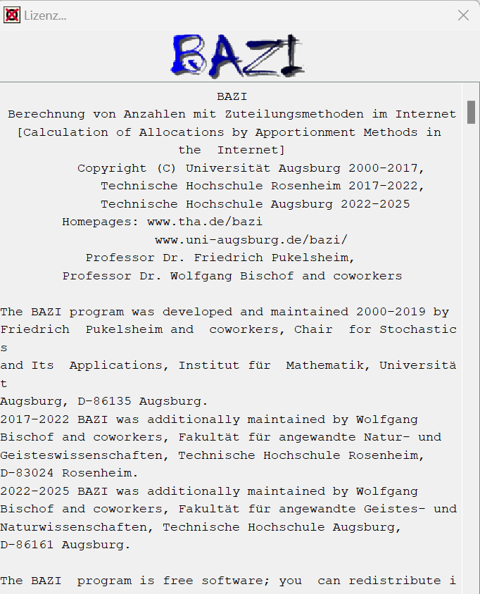
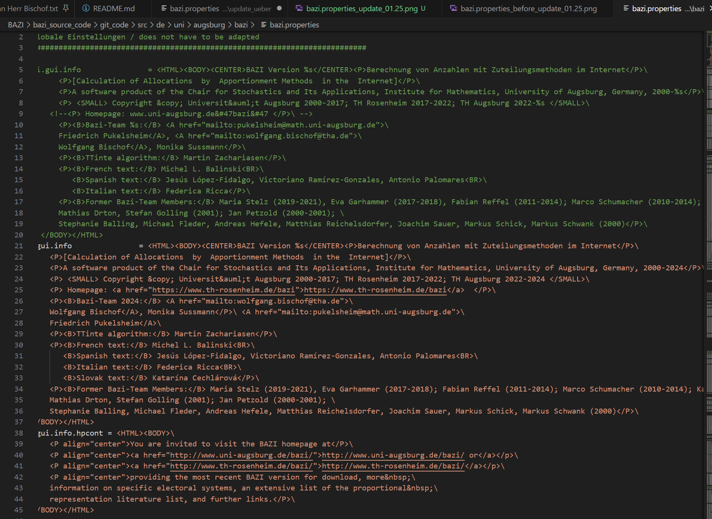
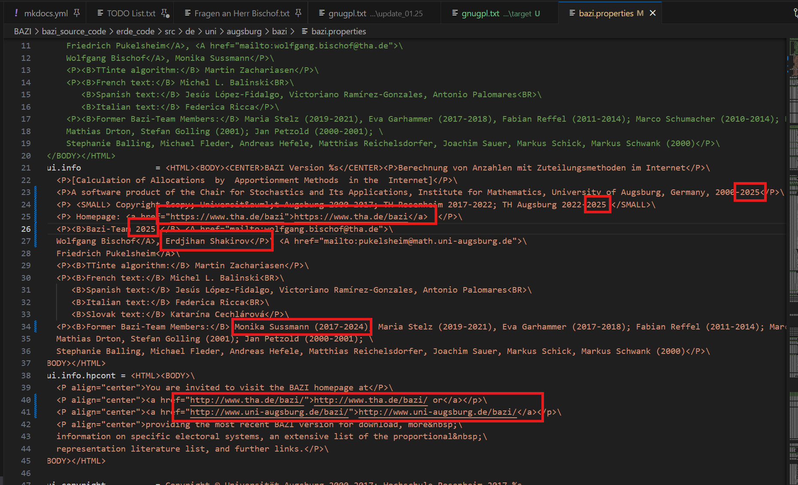
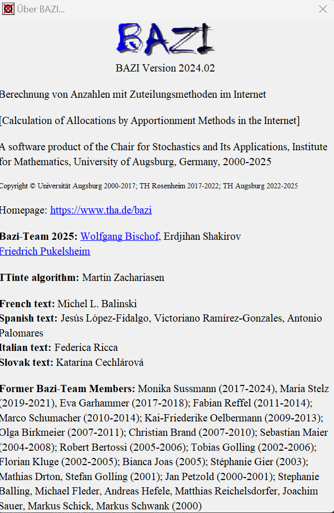
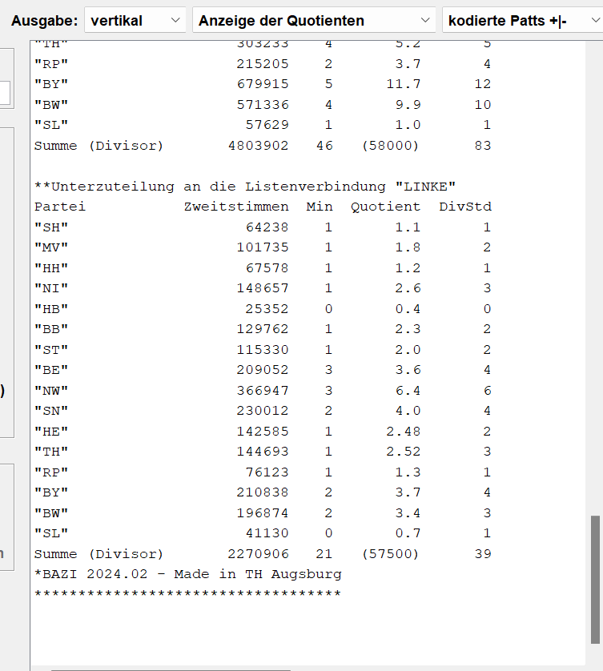

# Erledigte Aufgaben 01.25

## Aufgaben

```txt
BAZI Aufgaben

Lizenz:
- 2025 2x bei Zeiten angeben

- Homepage Eintrag: Erster eintrag THA Homepage, TH Rosenheim löschen

Über BAZI:
- 2025 bei Zeiten angeben

- THA Homepage einfügen und Rosenheim löschen

- BAZI Team: Sussmann raus, Erdjihan Shakirov einsetzen 

- Sussman bei former bazi Team einfügen 2017-2024


Bei Berechnungen Ausgabe:

- Made in TH Rosenheim ändern zu TH Augsburg.

data.zip:

@Herr Shakirov: Bitte alle EP-2024-Dateien und auch die Aargau-Datei vor dem Einchecken in die
data.zip UTF-8-kodieren, evtl. Kodierungsfehler beseitigen und den UTF-8-Tag reinschreiben. Danke!
Die Umstellung von "verkorksten" älteren bazi-Dateien auf UTF-8 ist nat. auch wünschenswert,
aber nur, wenn Sie Zeit und Lust haben.

- Neue EP.bazi & Aargau Dateien Kodierungsfehler beseitigen und den UTF-8-Tag reinschreiben
- Ältere bazi-Dateien Kodierungsfehler beseitigen und den UTF-8-Tag reinschreiben
```

## Lizenz

```txt
Lizenz:
- 2025 2x bei Zeiten angeben

- Homepage Eintrag: Erster eintrag THA Homepage, TH Rosenheim löschen
```

gnugpl.txt vor der Änderung:


gnugpl.txt nach der Änderung:


Lizenz in BAZI:




## Über BAZI

```txt
Über BAZI:
- 2025 bei Zeiten angeben

- THA Homepage einfügen und Rosenheim löschen

- BAZI Team: Sussmann raus, Erdjihan Shakirov einsetzen 

- Sussman bei former bazi Team einfügen 2017-2024
```

bazi.properties vor der Änderung:



bazi.properties nach der Änderung:



Über Bazi:




## Berechnungen Ausgabe

```txt
Bei Berechnungen Ausgabe:

- Made in TH Rosenheim ändern zu TH Augsburg.
```

Calculation.java vor der Änderung:


Calculation.java nach der Änderung:


Ausgabe nach Berechnung:




## data.zip

```txt
- Neue EP.bazi Dateien Kodierungsfehler beseitigen und den UTF-8-Tag reinschreiben
- Ältere bazi-Dateien Kodierungsfehler beseitigen und den UTF-8-Tag reinschreiben
```

### AArgauGrossratswahlen:

Zeile 199: <br>
Die Mitte Die Mitte, die CVP (Christlichdemokratische Volkspartei) fusionierte 2021 mit der BDP (B�rgerlich-Demokratische Partei) <br>
Die Mitte Die Mitte, die CVP (Christlichdemokratische Volkspartei) fusionierte 2021 mit der BDP (Bürgerlich-Demokratische Partei) 


Zeile 200: <br>
GP      Gr�ne <br>
GP      Grüne

Zeile 201: <br>
GLP     Gr�nliberale Partei Aargau <br>
GLP     Grünliberale Partei Aargau

Zeile 203: <br>
EDU     Eidgen�ssisch-Demokratische Union GP <br>
EDU     Eidgen�össisch-Demokratische Union GP

Zeile 207: <br>
LOVB     L�sungs-Orientierte-Volks-Bewegung <br>
LOVB     Lösungs-Orientierte-Volks-Bewegung

Zeile 211: <br>
DBP      DieB�rgerPartei <br>
DBP      DieBürgerPartei

Zeile 212: <br>
MASSVOLL MASS-VOLL! Bewegung f�r Freiheit, Souver�nit�t & Grundrechte <br>
MASSVOLL MASS-VOLL! Bewegung für Freiheit, Souveränität & Grundrechte

Zeile 216: <br>
          oder 3% W�hleranteil im gesamten Kanton <br>
          oder 3% Wähleranteil im gesamten Kanton 

Zeile 227: <br>
Bearbeiter: Daniel K�ppeli, 21.10.2024 <br>
Bearbeiter: Daniel Käppeli, 21.10.2024

- Notiz: Daniel Käppeli ist Parteileitung von Die Mitte Kanton Aargau deswegen denke ich, dass der Name so passt. https://www.daniel-kaeppeli.ch/inhalte/ueber-mich/

Zeile 228: <br>
=KODIERUNG= UTF-8


### EP2024LU:

Zeile 29: <br>
=KODIERUNG= UTF-8

### EP2024NL:

Zeile 32: <br>
Bearbeiter: F. Pukelsheiim Okt.  2024 <br>
Bearbeiter: F. Pukelsheim Okt.  2024

Zeile 33: <br>
=KODIERUNG= UTF-8

### EP2024PT:

Zeile 33: <br>
=KODIERUNG= UTF-8

### EP2024SK:

Zeile 46: <br>
=KODIERUNG= UTF-8

### /data/Belgique/Parlement_Wallon/1999/Liege1999.bazi

Zeile 1: <br>
=TITEL= Province de Li.A��ge - Parlement Wallon - 1999 <br>
=TITEL= Province de Liège - Parlement Wallon - 1999

Zeile 6: <br>
=DISTRICT= Li��ge <br>
=DISTRICT= Liège

Zeile 36: <br>
Repr��sentations parlementaires - <br>
Représentations parlementaires -

Zeile 37: <br>
M��thodes math��matiques biproportionnelles <br>
Méthodes mathématiques biproportionnelles

Zeile 38: <br>
de R��partition des Si��ges. <br>
de Répartition des Sièges.

Zeile 39: <br>
Br��ssel 2000 <br>
Brüssel 2000

Zeile 44: <br>
=KODIERUNG= UTF-8

### data/Belgique/Senat/1978/Liege1978.bazi

Zeile 1: <br>
=TITEL= Province de Li.A��ge - Senat - 1978 <br>
=TITEL= Province de Liège - Sénat - 1978

Zeile 6: <br>
=DISTRICT= Li��ge <br>
=DISTRICT= Liège

Zeile 35: <br>
Repr��sentations parlementaires - <br>
Représentations parlementaires -

Zeile 36: <br>
M��thodes math��matiques biproportionnelles <br>
Méthodes mathématiques biproportionnelles 

Zeile 37: <br>
de R��partition des Si��ges. <br>
de Répartition des Sièges.

Zeile 38: <br>
Br��ssel 2000 <br>
Brüssel 2000

Zeile 43: <br>
=KODIERUNG= UTF-8

### /data/Schweiz/NZZ_spekulativ/Gemeinderatswahlen_Zuerich/Zh1998GRW_NZZ.bazi

Zeile 196: <br>
"13 KITT-KINDER-TAGESTREFF KINDER- ……"	

**FRAGE, BITTE ANTWORTEN**: Datei geöffnet in ISO 8859-1 scheint korrekt zu sein, aber diese Fragezeichen bleiben. Sind diese gewollt oder ist es nur Zufall, dass es scheint als wäre es ISO 8859-1. Wenn sie nicht passen, was soll stattdessen hin?

### /data/_Deutschland/5_Landtage/Bayern/15._Bay._LT_2003/blt2003hyp.bazi

Zeile 19: <br>
=KODIERUNG= UTF-8

### /data/_Europe/EP_Composition/EU28_base+prop(pwr).bazi

Zeile 55: <br>
=KODIERUNG= UTF-8

Notiz: Fehler ohne utf 8 ist in Zeile 41 'Rafał'

### /data/_Europe/EP_Elections/EP_2009/EP2009biprop.bazi

Wird als Fehler angezeigt, aber ich finde keine Kodierungsfehler. Enthält wahrscheinlich ein seltenes Zeichen, was in der Liste der Fehlerzeichen ist.

### /data/_Europe/EP_Elections/EP_2009/EP2009IT.bazi

Zeile 61: <br>
is allied with the Partito democratico, the Vallee d’Aoste with Il <br>
is allied with the Partito Democratico, the Vallée d'Aoste with Il

### /data/_Europe/EP_Elections/EP_2014/EP2014CY.bazi

Zeile 65: <br>
NATIONAL PEOPLE’S FRON (ELAM):	 6,957 <br>
NATIONAL PEOPLE’S FRONT (ELAM):	 6,957

Zeile 38: <br>
=KODIERUNG= UTF-8

### /data/_Europe/EP_Elections/EP_2014/EP2014EE.bazi

Zeile 58: <br>
=KODIERUNG= UTF-8

### /data/_Europe/EP_Elections/EP_2014/EP2014EL.bazi

Zeile 65: <br>
=KODIERUNG= UTF-8

### /data/_Europe/EP_Elections/EP_2014/EP2014HR.bazi

Zeile 44: <br>
=KODIERUNG= UTF-8

### /data/_Europe/EP_Elections/EP_2014/EP2014IE.bazi

Zeile 84: <br>
=KODIERUNG= UTF-8

### /data/_Europe/EP_Elections/EP_2014/EP2014IT.bazi

Zeile 82: <br>
=KODIERUNG= UTF-8

### /data/_Europe/EP_Elections/EP_2014/EP2014LT.bazi

Zeile 48: <br>
=KODIERUNG= UTF-8

### /data/_Europe/EP_Elections/EP_2014/EP2014LU.bazi

Zeile 42: <br>
=KODIERUNG= UTF-8

### /data/_Europe/EP_Elections/EP_2014/EP2014LV.bazi

Zeile 38: <br>
=KODIERUNG= UTF-8

### /data/_Europe/EP_Elections/EP_2014/EP2014PL.bazi

Zeile 103: <br>
=KODIERUNG= UTF-8

### /data/_Europe/EP_Elections/EP_2014/EP2014RO.bazi

Zeile 43: <br>
=KODIERUNG= UTF-8

### /data/_Europe/EP_Elections/EP_2014/EP2014SI.bazi

Zeile 43: <br>
=KODIERUNG= UTF-8

### /data/_Europe/EP_Elections/EP_2014/EP2014SK.bazi

Zeile 60: <br>
=KODIERUNG= UTF-8

### data/_Europe/EP_Elections/EP_2009/EP2009RO.bazi

Wird als Fehler angezeigt, aber ich finde keine Kodierungsfehler.

### data/_Europe/EP_Elections/EP_2014/EP2014FI.bazi

Wird als Fehler angezeigt, aber ich finde keine Kodierungsfehler.

### /data/_Europe/EP_Elections/EP_2014/EP2014PT.bazi

Wird als Fehler angezeigt, aber ich finde keine Kodierungsfehler.

### /data/_Europe/EP_Elections/EP_2019/EP2019SK.bazi

Wird als Fehler angezeigt, aber ich finde keine Kodierungsfehler.


