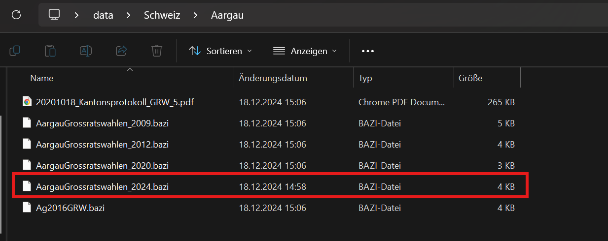
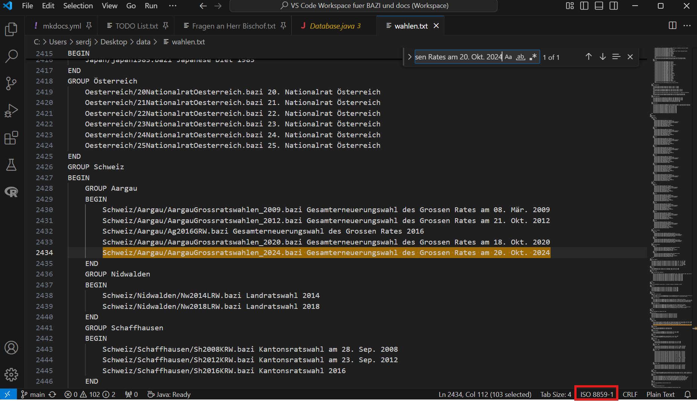

# Hinzufügen der Gesamterneuerungswahlen des Grossen Rates 2024

Die Aufgabe besteht daraus, die mir bereitgestellte 'AargauGrossratswahlen_2024.bazi' Datei, zur Database 'data.zip' hinzuzufügen.

---

## Herunterladen der 'data.zip' Datei

Zuerst habe ich die Datei von der Webseite [https://www.tha.de/Geistes-und-Naturwissenschaften/Data-Science/BAZI.page](https://www.tha.de/Geistes-und-Naturwissenschaften/Data-Science/BAZI.page) heruntergeladen.

---

## Entpacken und Einfügen der Datei

Unter Windows:
    - Mit Rechtsklick 'Alle Extrahieren' die Datei entpacken
    - Hinzufügen der Datei in den richtigen Unterorder
    

Die Wahl fand in der Schweiz statt und in der Stadt Aargau. Aufgrund der Ordnerstruktur war der richtige Unterordner simpel zu finden.

## Bearbeiten der 'wahlen.txt' Datei

'wahlen.txt' ist die Datei welche dem BAZI-Programm mitteilt, welche Wahlen in der Database vorhanden sind und muss angepasst werden, wenn neue Wahlen hinzufügt werden.

Um die Wahl in der Schweiz hinzuzufügen musste ich den Dateipfad zur Wahl in der richtigen Gruppe angeben. Zusätzlich musste ich die Kodierung in der die Datei 'wahlen.txt' geöffnet und gespeichert wird in Visual Studio Code umstellen, um Fehler bei Umlauten und anderen Zeichen zu verhindern. Die richtige Kodierung konnte ich aus der Datei projekt\src\de\uni\augsburg\bazi\gui\Database.java entnehmen in dem ich nach 'data.zip' in der IDE gesucht habe, da es offensichtlich ist, dass die Datei 'data.zip' im Code erwähnt werden muss.

## Zip-en der 'wahlen.txt' Datei

Das zip-en der Datei ist notwendig, da das BAZI-Programm eine .zip Datei erwartet. Hierbei ist zu achten, dass die nicht der entpackte data-Ordner gezipt wird sondern, dass der Inhalt des Ordners gezipt wird und die neue Datei 'data.zip' heißt, da sonst eine unerwartete Ordnerstruktur gegeben ist.

Statt data.zip/usw. ist sonst data.zip/data/usw. gegeben.