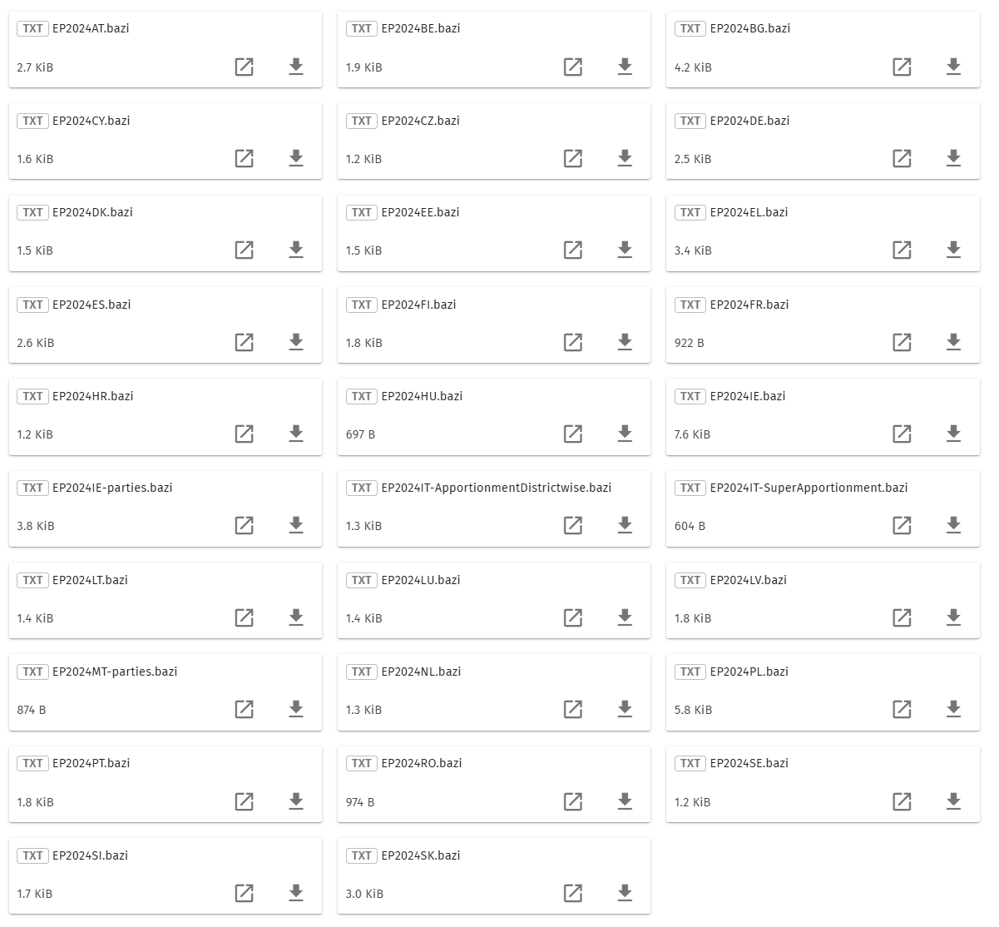

# Einfügen der EP Wahl 2024 in die zip Database

Die Aufgabe besteht daraus die europäischen Wahlen aus 2024 in die Datenbank aufzunehmen.

Hier sind alle Dateien zu sehen, welche in die Datenbank aufgenommen werden sollen.

In der Datei [EP Wahl 2024 Database changes](ep_wahl_2024_database_changes.md) sind alle Änderungen zu sehen.

