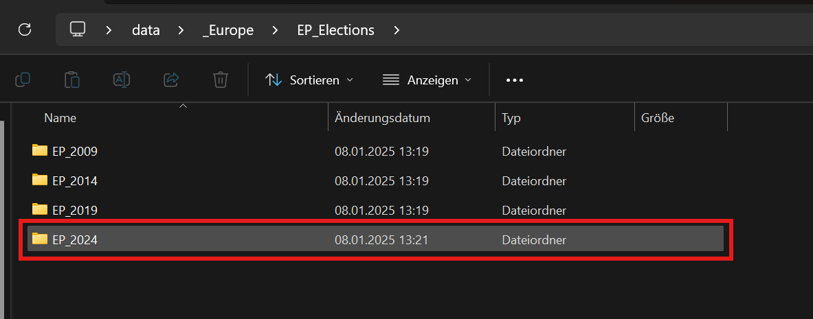
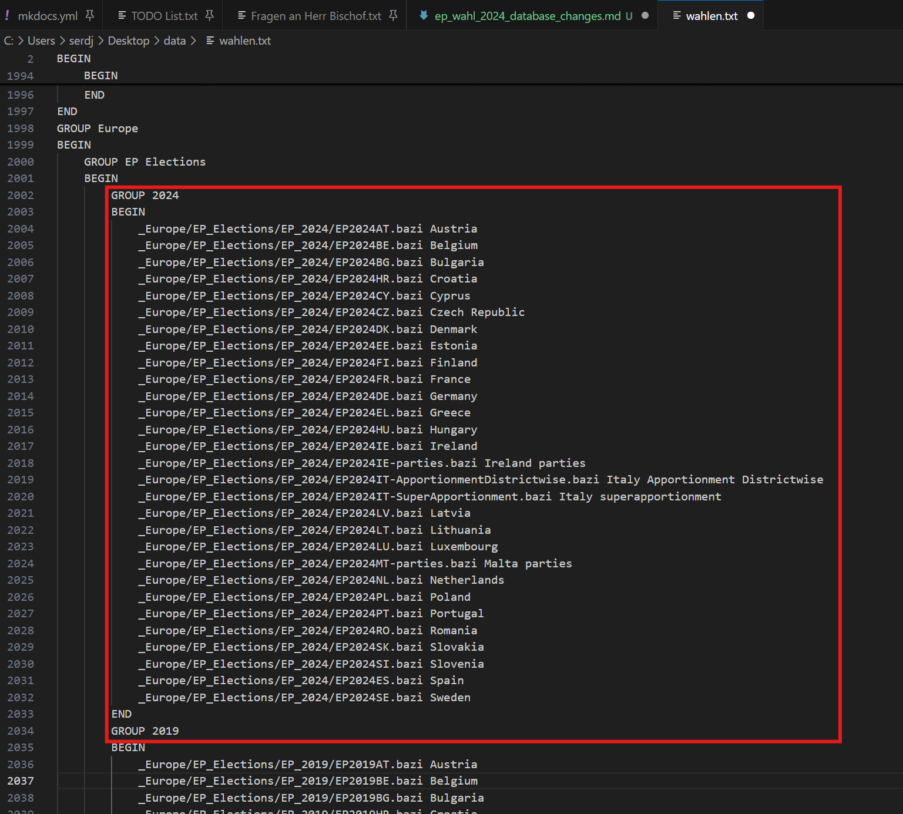

# Dokumentation der Änderung der Database in Bezug auf EP Wahl 2024

Dieses Dokument beinhaltet alle Änderungen an der zip Database, welche ich im Verlauf des Hinzufügens der Europa Wahlen 2024 getätigt habe.



Als Erstes habe ich einen Ordner für die Wahlen hinzugefügt, da die Struktur der Ordner dies augenscheinlich vorgibt.

Danach habe ich alle Wahlen, die ich per E-Mail erhalten habe, in diesen Ordner eingefügt.



Als Nächstes habe ich die 'wahlen.txt' Datei angepasst. Hierfür habe ich die selbe Struktur genutzt wie bei den EP Wahlen 2019. Dazu habe ich darauf geachtet, dass die Einträge nach dem Alphabet sortiert sind und dass die Datei in ISO 8859-1 gespeichert wurde.


Danach habe ich die neue 'data.zip' mit meinem Programm zum Finden von Kodierungsfehlern (aus dem Ordner 'fehler_finden') überprüft. Als Ergebnis kam, dass auch die neuen Dateien wahrscheinlich solche Fehler beinhalten.

Liste der neuen bazi-Dateien mit wahrscheinlichen Fehlern:

```
Gefunden in: C:\Users\serdj\Desktop\data\_Europe\EP_Elections\EP_2024\EP2024LU.bazi
Gefunden in: C:\Users\serdj\Desktop\data\_Europe\EP_Elections\EP_2024\EP2024NL.bazi
Gefunden in: C:\Users\serdj\Desktop\data\_Europe\EP_Elections\EP_2024\EP2024PT.bazi
Gefunden in: C:\Users\serdj\Desktop\data\_Europe\EP_Elections\EP_2024\EP2024SK.bazi
```

Hierfür habe ich nur die Datei 'EP2024SK.bazi' manuel überprüft und bei dieser fehlt der UTF-8 Tag.