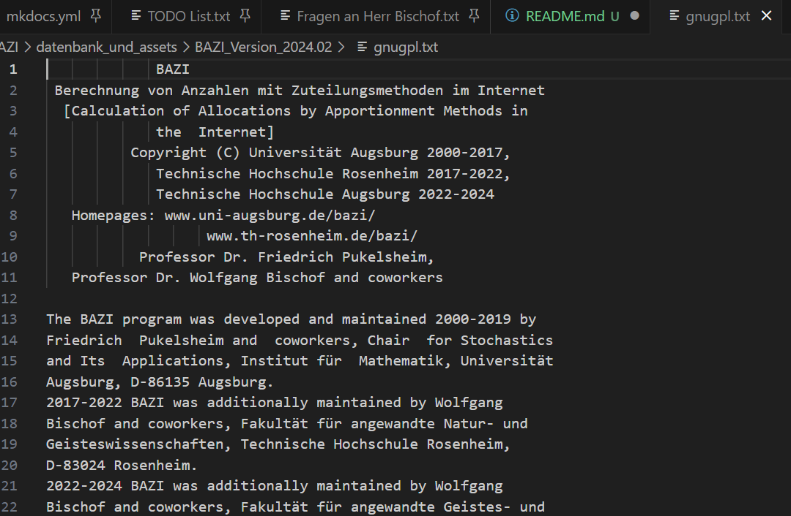
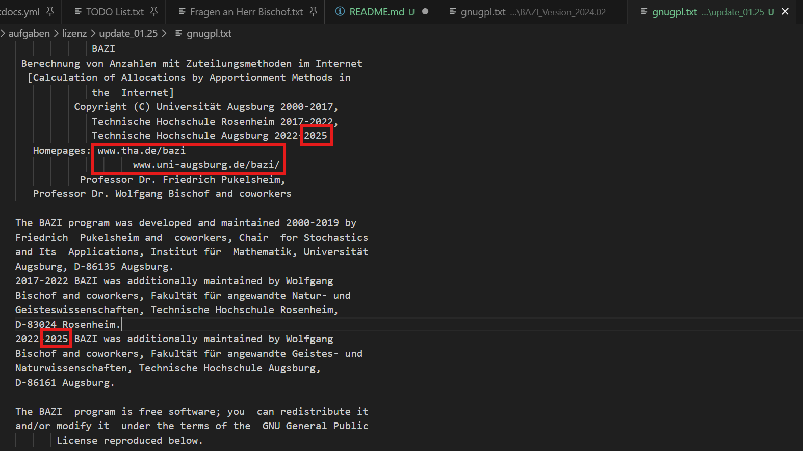

# Updaten der Lizenz 01.25

Die Aufgabe, die ich von Herr Bischof bekommen habe, ist die Anpassung der Lizenz für 2025 und das Einfügen der neuen Homepage von BAZI

---

## Lizenz finden

Dies ist das erste Mal, dass ich Änderungen an der Lizenz vornehmen soll. Hierbei wurde mir nicht erklärt wo diese zu finden ist. Das Programm habe ich mit dem Source Code zum Laufen gebracht und da wurde als ich die Lizenz im Programm sehen wollte 'Not found: gnugpl.txt' angezeigt. Diese Datei lässt sich nur beim Download vom gebauten BAZI Programm unter [tha.de/bazi](tha.de/bazi) finden.

---

## Lizenz anpassen

gnugpl.txt vor der Änderung:

Lizenz nach der Änderung:

