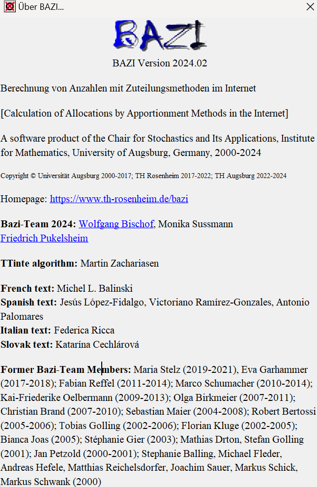

### `AboutDialog.java`

Diese Seite dokumentiert die Klasse `AboutDialog` aus dem Projekt **BAZI**. Die Datei ist Teil der grafischen Benutzeroberfläche (GUI) und wird verwendet, um Informationen über die Anwendung in einem Dialogfenster anzuzeigen. Das Fenster kann geöffnet werden im Hauptfenster unter "Hilfe/Einstellungen"->"Über BAZI"


{: style="height:350px"}


---

## Vollständiger Quellcode

```java
// AboutDialog.java
package de.uni.augsburg.bazi.gui;

import java.awt.BorderLayout;
import java.awt.Dimension;
import java.awt.Font;
import java.awt.GridBagConstraints;
import java.io.BufferedReader;
import java.io.File;
import java.io.FileInputStream;
import java.io.IOException;
import java.io.InputStreamReader;

import javax.swing.ImageIcon;
import javax.swing.JDialog;
import javax.swing.JEditorPane;
import javax.swing.JLabel;
import javax.swing.JPanel;
import javax.swing.JScrollPane;
import javax.swing.JTabbedPane;
import javax.swing.event.HyperlinkEvent;
import javax.swing.event.HyperlinkListener;

import de.uni.augsburg.bazi.Resource;
import de.uni.augsburg.bazi.VersionControl;

public class AboutDialog extends JDialog {

    private static final long serialVersionUID = 1L;

    public AboutDialog(final RoundFrame roundFrame, ImageIcon logo) {
        super(roundFrame, Resource.getString("bazi.gui.menu.about"), true);

        JPanel pMain = new JPanel(new BorderLayout());
        JLabel label = new JLabel(logo);

        pMain.add(label, BorderLayout.NORTH);

        JPanel contentPanel = new JPanel();
        String content = String.format(Resource.getString("bazi.gui.info"), VersionControl.getVersion(), VersionControl.YEAR, VersionControl.YEAR, VersionControl.YEAR);
        JEditorPane jepAbt = new JEditorPane("text/html", content);
        jepAbt.setEditable(false);
        pMain.add(jepAbt, BorderLayout.CENTER);
        jepAbt.setBackground(label.getBackground());
        jepAbt.addHyperlinkListener(new HyperlinkListener() {
            @Override
            public void hyperlinkUpdate(HyperlinkEvent e) {
                if (e.getEventType() == HyperlinkEvent.EventType.ACTIVATED) {
                    roundFrame.showDocument(e.getDescription());
                }
            }
        });

        int w = Integer.parseInt(Resource.getString("bazi.gui.info.width"));
        int h = Integer.parseInt(Resource.getString("bazi.gui.info.height"));
        jepAbt.setPreferredSize(new Dimension(w, h));
        jepAbt.setRequestFocusEnabled(false);

        setContentPane(pMain);
        pack();
        setLocationRelativeTo(roundFrame);
        setVisible(true);
    }
}
```

---

## Übersicht und Erklärung des Codes

### **Paket- und Import-Anweisungen**
```java
package de.uni.augsburg.bazi.gui;
import java.awt.*;
import java.io.*;
import javax.swing.*;
import javax.swing.event.*;
```
- **Paket:** Der Code gehört zur GUI des Projekts `BAZI`.
- **Imports:** Notwendige Klassen für GUI-Komponenten (`JDialog`, `JEditorPane`, `JLabel` etc.), Layout-Management, Dateioperationen und Event-Handling.

---

### **Klassendeklaration**
```java
public class AboutDialog extends JDialog
```
- `AboutDialog` ist eine Unterklasse von `JDialog` und stellt einen modalen Dialog dar.

---

### **Konstruktor**
```java
public AboutDialog(final RoundFrame roundFrame, ImageIcon logo)
```
- **Parameter:** 
  - `roundFrame`: Die übergeordnete Komponente, von der der Dialog abhängig ist.
  - `logo`: Das Logo, das oben im Dialog angezeigt wird.
- **Super-Konstruktor:** Initialisiert den Dialog mit einem Titel, der aus der Ressourcendatei geladen wird.

---

### **UI-Komponenten**
#### **Haupt-Panel**
```java
JPanel pMain = new JPanel(new BorderLayout());
JLabel label = new JLabel(logo);
pMain.add(label, BorderLayout.NORTH);
```
- Ein Haupt-Panel (`pMain`) mit einem `BorderLayout`.
- Das Logo wird im `NORTH`-Bereich hinzugefügt.

#### **Informationstext**
```java
String content = String.format(Resource.getString("bazi.gui.info"), VersionControl.getVersion(), VersionControl.YEAR);
JEditorPane jepAbt = new JEditorPane("text/html", content);
jepAbt.setEditable(false);
pMain.add(jepAbt, BorderLayout.CENTER);
```
- Der Informationstext wird in einem `JEditorPane` als HTML-Inhalt dargestellt.
- **Dynamischer Inhalt:** Die Version und Jahre werden aus der `VersionControl`-Klasse geladen.

#### **Hyperlink-Listener**
```java
jepAbt.addHyperlinkListener(new HyperlinkListener() {
    @Override
    public void hyperlinkUpdate(HyperlinkEvent e) {
        if (e.getEventType() == HyperlinkEvent.EventType.ACTIVATED) {
            roundFrame.showDocument(e.getDescription());
        }
    }
});
```
- Ermöglicht, dass Hyperlinks im Text aufgerufen werden können.

#### **Dimensionierung**
```java
int w = Integer.parseInt(Resource.getString("bazi.gui.info.width"));
int h = Integer.parseInt(Resource.getString("bazi.gui.info.height"));
jepAbt.setPreferredSize(new Dimension(w, h));
```
- Die Breite und Höhe des Dialogs wird aus der `Resource`-Datei geladen.

---

### **Anzeigen des Dialogs**
```java
setContentPane(pMain);
pack();
setLocationRelativeTo(roundFrame);
setVisible(true);
```
- Das Haupt-Panel wird als Content-Pane des Dialogs gesetzt.
- Der Dialog wird zentriert und angezeigt.

---

## Weiterführende Informationen

### **Verwendete externe Klassen**
- **`Resource`:** Zum Laden von lokalisierten Strings und UI-Konfigurationen.
- **`VersionControl`:** Zum Abrufen von Versions- und Jahresinformationen.

---

### **Mögliche Erweiterungen**
1. **Lizenzinformationen:** 
   Der auskommentierte Code zeigt eine geplante Erweiterung für die Anzeige der Lizenz (z. B. GPL).
2. **Tab-Funktionalität:** 
   Ein `JTabbedPane` kann verwendet werden, um verschiedene Abschnitte (z. B. Info, Lizenz, Homepage) zu trennen.

---

Diese Dokumentation bietet eine strukturierte Einführung in den Code und kann in **MkDocs** leicht integriert werden.