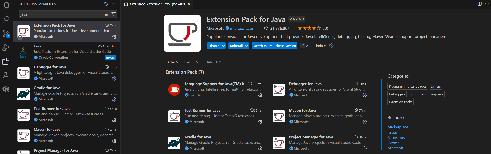
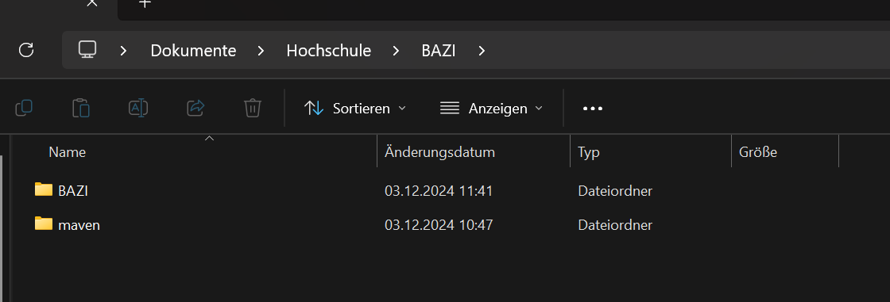
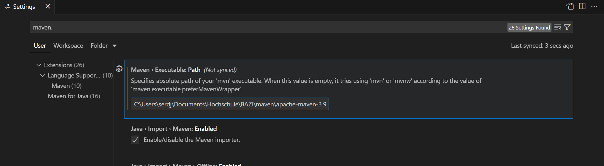
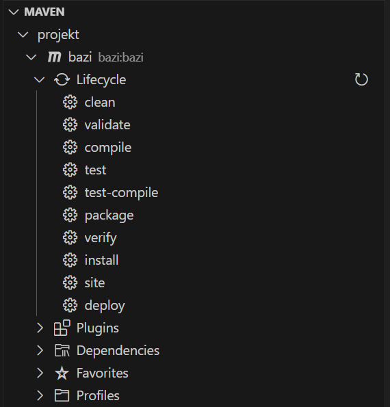

# Einrichtung von BAZI in Visual Studio Code auf Windows

## 1. JDK installieren

Bevor du mit der Einrichtung des Projekts beginnen kannst, musst du sicherstellen, dass das Java Development Kit (JDK) auf deinem Rechner installiert ist. 

1. Lade das JDK 23 von der offiziellen Oracle-Webseite herunter:  
   [JDK 23 Download](https://www.oracle.com/de/java/technologies/downloads/#jdk23-windows)
2. Installiere das JDK auf deinem System, indem du den Anweisungen auf der Webseite folgst.

## 2. Visual Studio Code installieren

Nun musst du Visual Studio Code installieren:

1. Besuche die Visual Studio Code-Webseite und lade die neueste Version für Windows herunter:  
   [Visual Studio Code Download](https://code.visualstudio.com/)
2. Installiere Visual Studio Code, indem du den Anweisungen folgst.

## 3. BAZI-Repository klonen oder herunterladen

Jetzt musst du das BAZI-Repository auf deinen Rechner holen:

1. Du kannst das Repository entweder direkt klonen oder die ZIP-Datei herunterladen:
   - **Repository klonen**:  
     Führe in der Kommandozeile den folgenden Befehl aus, um das Repository zu klonen:  
     ```
     git clone https://bitbucket.org/bazi/bazi/src/master/
     ```
   - **ZIP-Datei herunterladen**:  
     Gehe zu [BAZI Downloads](https://bitbucket.org/bazi/bazi/downloads/) und lade die ZIP-Datei herunter. Entpacke diese Datei in einen Ordner auf deinem Rechner.

## 4. Java-Extension in Visual Studio Code installieren

Um das Java-Projekt in Visual Studio Code zu bearbeiten, musst du die passende Extension installieren:

1. Öffne Visual Studio Code und gehe zum **Extensions**-Tab (Sidebar auf der linken Seite).
2. Suche nach **"Extension Pack for Java"** und installiere das Paket.
   
   

## 5. Maven herunterladen und entpacken

Für das BAZI-Projekt benötigst du Apache Maven, um das Projekt zu bauen und zu paketieren:

1. Gehe zur Maven-Website und lade das neueste Maven-Binary herunter:  
   [Maven Download](https://maven.apache.org/download.cgi)
2. Entpacke das heruntergeladene ZIP-Archiv. Du kannst es in einen Ordner innerhalb des BAZI-Projekts entpacken.

   

## 6. Maven Executable Path in Visual Studio Code konfigurieren

Nun musst du den **Maven Executable Path** in Visual Studio Code angeben:

1. Öffne Visual Studio Code und gehe zu **File** → **Preferences** → **Settings**.
2. Suche nach **"Maven"** und finde den Abschnitt **Maven: Executable Path**.
3. Setze den Pfad auf das Verzeichnis, in dem du Maven entpackt hast. Der Pfad zur `mvn`-Datei befindet sich im entpackten Ordner unter `bin`.

   

## 7. Projekt in Visual Studio Code öffnen

1. Öffne das BAZI-Projekt in Visual Studio Code, indem du zu **File** → **Open Folder** gehst und den Ordner auswählst, in den du das Projekt heruntergeladen oder entpackt hast.

## 8. Das Projekt starten

Jetzt kannst du das Projekt starten:

1. Navigiere zu `src/de/uni/augsburg/bazi/Start.java` im Explorer von Visual Studio Code.
2. Öffne die Datei `Start.java`.
3. Klicke auf den **grünen Start-Button** (das Dreieck oben rechts), um das Projekt auszuführen.

## 9. Eine .jar-Datei erstellen

Wenn du eine `.jar`-Datei erstellen möchtest, kannst du Maven verwenden:

1. Öffne den **Maven-Explorer** in Visual Studio Code, der sich in der Seitenleiste befindet.
2. Erweitere den **Maven**-Knoten und dann den **bazi**-Knoten.
3. Unter dem Abschnitt **Lifecycle** findest du zwei wichtige Optionen:
   - **clean**: Entfernt bereits bestehende `.jar`-Dateien.
   - **package**: Erstellt eine neue `.jar`-Datei.

   

4. Die erstellte `.jar`-Datei findest du im `target`-Ordner des Projekts.

## 10. Nutzung der Datenbank

Wenn du die Datenbank verwenden möchtest, musst du die Datei `data.zip` herunterladen und in den `target`-Ordner verschieben:

1. Lade die Datei **data.zip** von der folgenden Webseite herunter:  
   [Datenbank herunterladen](https://www.tha.de/Geistes-und-Naturwissenschaften/Data-Science/BAZI.page)
2. Entpacke die Datei **nicht**, sondern verschiebe die **unzipped `data.zip`** direkt in den `target`-Ordner.

Nun kannst du das Projekt mit der Datenbank verwenden.
